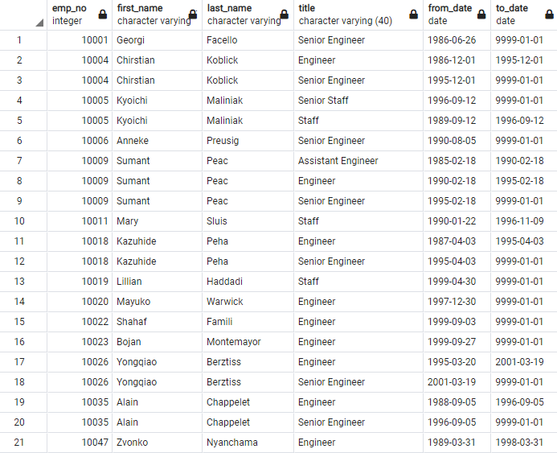
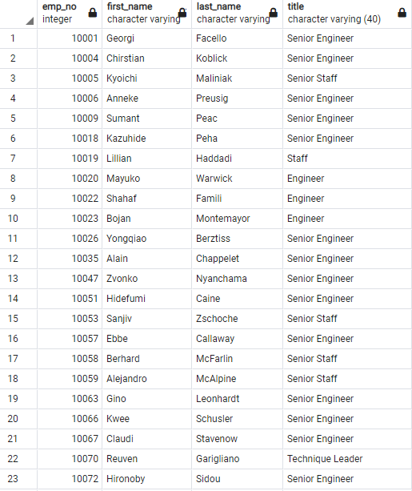
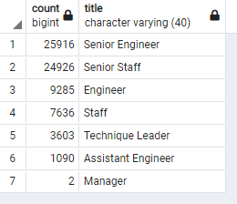
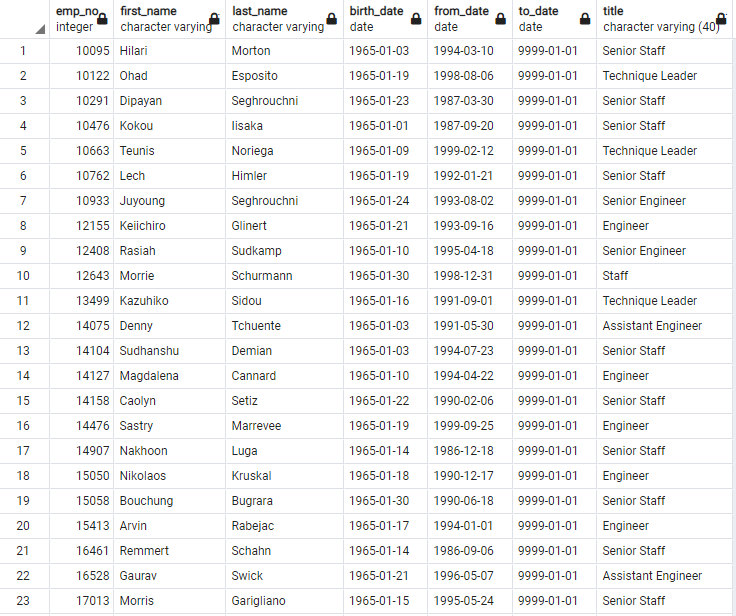
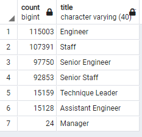
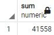
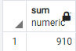

# Pewlett-Hackard-Analysis

## Overview

This analysis searches to account for employees nearing retirement and those likely eligible for mentorship in interest of the Pewlett Hackard company. Using Postgresql, several new tables are created and exported from queries such as retirement_titles.csv, unique_titles.csv, retiring_titles.csv, and mentorship_eligibilty.csv to help determine Pewlett Hackard's future steps. 

## Results

 * By joining the titles and employees tables, we find multiple records with the same name but different titles.
  
 
 
 * With some employees owning multiple titles having worked with the company for a large period of time, we remove all rows with duplicate names.
 
 
 
 * The count function provides the number of employees approaching retirement by company title.
 
 
 
 * Through joining 3 tables, we find all currently employed employees approaching retirement who are eligible for mentoring the next generation.
 
 

## Summary
There will be a total of 72,458 openings of the approximate 440,000 positions after the "silver tsunami" impacts Pewlett Hackard making preparations a must for this company's sustainability. 

General employee title count:

Retiring employee title count:

With the summation of the total names occuring twice or even three times in the retirement titles table, we have 42,468 of the 72,458 employees soon to retire whom have moved up in position within the company over time. Perhaps they would be deserving a stature of higher expertise within the company given their experience and would so warrant a conversation in regards to the mentorship eligibilty program. 

Sum of 2 unique name occurances:

Sum of 3 unique name occurances:

If the total 42,468 qualified up and coming retirees all chose to take part in the mentorship program and each chose to mentor one other person in the company, we would see about one tenth of the company being mentored. If the ideal one tenth of the company being taught to take over these upcoming ending positions was a sufficient quantity to preserve the functionality of Hewlett Packard, there would be enough qualified retirement ready employees for the task.
